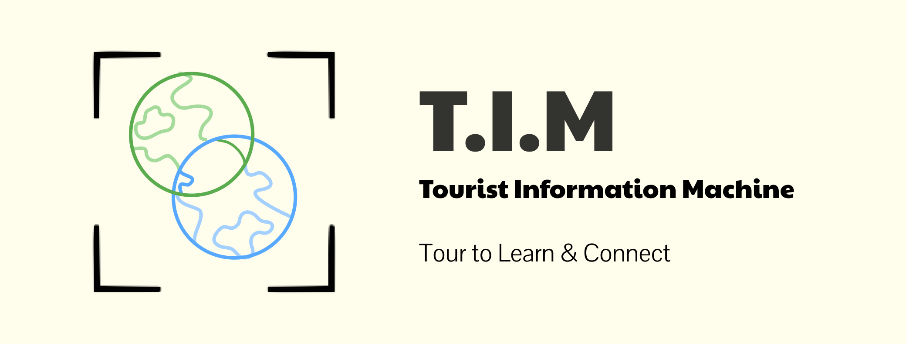

# Tourism Information Machine (T.I.M): Making Tourism Accessible for All

T.I.M is a platform that allows you to explore new or faraway locations with confidence! 

Submitted to GenAI Genesis 2025!

[](https://github.com/bruan5483/GenAI-Genesis-2025)

## About The Project
Have you ever been ...

### Built With
Here are the major languages/technologies we used for creating our project:
- [Python](https://www.python.org/)
- [Gemini](https://ai.google.dev/)
- [Google Cloud](https://cloud.google.com/)
- [OpenCV](https://opencv.org/)
- [Flask](https://flask.palletsprojects.com/en/stable/)

## Installation
This project utilizes the following:
- Raspberry Pi (Raspbian)
- USB Webcamera
- Portable Battery
- Case for Raspberry Pi 

#### Clone repository
```
git clone https://github.com/bruan5483/GenAI-Genesis-2025.git
cd GenAI-Genesis
```

#### Create Python venv
```
python -m venv ./venv
source ./venv/bin/activate
```

#### Dependencies
```
pip install flask
pip install numpy
pip install opencv-python-headless
pip install google-cloud-vision
pip install google-cloud-texttospeech
pip install google-cloud-aiplatform
pip install google-cloud-translate
pip install pillow
pip install playsound==1.2.2
pip install pygame
```

#### Google Cloud API Key
Follow Google Cloud setup here: https://developers.google.com/workspace/guides/get-started
Download the API_KEY and put it in ```./utils/google_service_token.json```

## Our Story

## License
Distributed under the MIT License. Refer to ```LICENSE.md``` for more information.

## Contact
If you would like to find out more information about our project, feel free to reach out to us on LinkedIn:
- Bryant Ruan - [LinkedIn](https://www.linkedin.com/in/bryant-ruan/) - b3ruan@uwaterloo.ca
- Gabe Singaraja - [LinkedIn](https://www.linkedin.com/in/gabe-singaraja-a74785266/) - g2singar@uwaterloo.ca
- Jonathan Zhao - [LinkedIn](https://www.linkedin.com/in/jonathan-zhao-208616325/) - j89zhao@uwaterloo.ca
- Joy Jia - [LinkedIn](https://www.linkedin.com/in/joyyjiaa/) - j56jia@uwaterloo.ca

To see our submission to [GenAI Genesis 2025](https://genai-genesis-2025.devpost.com/), feel free to check out our Devpost! 

## REMEMBER TO ADD LINK TO DEVPOST